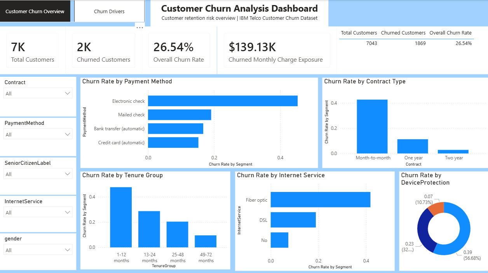
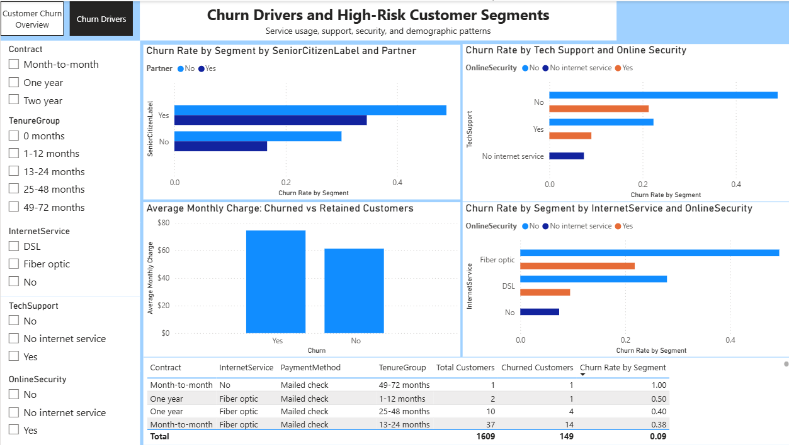

# Customer Churn Analysis

## Project Overview

This end-to-end Customer Churn Analysis project examines customer attrition patterns in a telecom company using Python, PostgreSQL, and Power BI.

The objective was to identify customer segments with elevated churn rates, understand the factors associated with churn, and recommend retention actions supported by analysis.

## Business Problem

Customer churn can reduce recurring revenue and increase customer-acquisition costs. The business needs to identify which customer segments are most likely to churn and where retention efforts should be prioritized.

This project answers questions such as:

- Which customer segments have the highest churn rates?
- How does churn vary by contract type, tenure, payment method, internet service, support, and security services?
- Which customer groups should be prioritized for retention campaigns?
- What actions should be tested to reduce churn?

## Dataset

This project uses the IBM Telco Customer Churn dataset.

The dataset contains 7,043 customer records and includes demographic information, account details, subscribed services, billing details, and churn status.

Key fields include:

- `customerID`
- `gender`
- `SeniorCitizen`
- `Partner`
- `Dependents`
- `tenure`
- `Contract`
- `PaymentMethod`
- `InternetService`
- `TechSupport`
- `OnlineSecurity`
- `MonthlyCharges`
- `TotalCharges`
- `Churn`

## Tools Used

- Python: pandas, NumPy, matplotlib, seaborn
- SQL: PostgreSQL and pgAdmin
- Business Intelligence: Power BI Desktop
- Version Control: Git and GitHub
- Development Environment: VS Code and Jupyter Notebook

## Project Workflow

1. Defined the churn business problem, stakeholders, scope, and analysis questions.
2. Profiled the raw dataset using Python.
3. Cleaned and standardized the dataset using pandas.
4. Loaded the cleaned dataset into PostgreSQL.
5. Performed churn analysis using SQL queries.
6. Conducted exploratory data analysis using Python.
7. Built a two-page Power BI dashboard.
8. Documented findings and retention recommendations.

## Data Cleaning

The dataset was cleaned using Python and pandas.

Cleaning steps included:

- Checked dataset shape, data types, missing values, duplicates, invalid values, and category consistency.
- Identified 11 blank values in `TotalCharges`.
- Converted `TotalCharges` from text to numeric.
- Filled blank `TotalCharges` values with 0 because all affected customers had tenure equal to 0.
- Confirmed there were no duplicate customer IDs.
- Created analysis-ready fields:
  - `ChurnFlag`
  - `SeniorCitizenLabel`
  - `TenureGroup`

The cleaned dataset contains 7,043 rows and 24 columns with no missing values.

## SQL Analysis

PostgreSQL was used to analyze churn patterns by:

- Contract type
- Tenure group
- Payment method
- Internet service
- Tech support and online security
- Senior citizen, partner, and dependent combinations
- Monthly charge exposure

SQL scripts are available in the `sql/` folder.

## Dashboard

The Power BI dashboard contains two pages:

### 1. Customer Churn Overview

Includes:

- Total Customers
- Churned Customers
- Overall Churn Rate
- Churned Monthly Charge Exposure
- Churn rate by contract type
- Churn rate by tenure group
- Churn rate by payment method
- Churn rate by internet service
- Interactive slicers

### 2. Churn Drivers and High-Risk Customer Segments

Includes:

- Churn rate by senior citizen and partner status
- Churn rate by tech support and online security
- Churn rate by internet service and online security
- Average monthly charge comparison between churned and retained customers
- Detailed high-risk segment table

## Dashboard Screenshots

### Customer Churn Overview



### Churn Drivers



## Key Findings

- The overall churn rate was **26.54%**, with 1,869 churned customers out of 7,043 total customers.
- Month-to-month customers had the highest churn rate at **42.71%**.
- Customers with 1–12 months of tenure had the highest churn rate at **47.68%**.
- Electronic check customers had the highest payment-method churn rate at **45.29%**.
- Fiber optic customers had a churn rate of **41.89%**.
- Customers without both tech support and online security had a churn rate of **48.96%**.
- Senior customers without partners had a churn rate of **49.20%**.
- Churned customers represented **$139,130.85** in monthly charge exposure.

## Retention Recommendations

- Build an early-life retention program for customers in their first 12 months.
- Encourage month-to-month customers to move to longer contracts through targeted offers.
- Promote autopay adoption among electronic check customers.
- Bundle tech support and online security for high-risk customers.
- Investigate the fiber optic customer experience using service quality, pricing, complaint, and satisfaction data.
- Provide proactive support and simplified service journeys for senior customers without partners.

These recommendations are based on observed patterns in the dataset and should be validated through controlled experiments before full implementation.

## Repository Structure

```text
customer-churn-analysis/
│
├── data/
│   ├── raw/
│   │   └── telco_customer_churn_raw.csv
│   └── cleaned/
│       └── telco_customer_churn_cleaned.csv
│
├── notebooks/
│   ├── 01_data_profiling.ipynb
│   ├── 02_data_cleaning.ipynb
│   └── 03_exploratory_data_analysis.ipynb
│
├── sql/
│   ├── 01_create_and_load_table.sql
│   ├── 01b_create_staging_table.sql
│   ├── 02_data_validation.sql
│   └── 03_churn_analysis_queries.sql
│
├── powerbi/
│   └── customer_churn_dashboard.pbix
│
├── dashboard_screenshots/
│   ├── 01_customer_churn_overview.png
│   └── 02_churn_drivers.png
│
├── docs/
│   ├── data_cleaning_log.md
│   └── phase_8_findings_and_recommendations.md
│
└── README.md

## Limitations
The dataset is historical and may not reflect current customer behavior.
The analysis identifies associations, not causal relationships.
The dataset does not include customer satisfaction, complaint history, network outage information, competitor activity, or stated reasons for churn.
Monthly charge exposure is not equivalent to lifetime revenue loss.
Some high-churn segments may contain relatively few customers and should be interpreted carefully.


## Next Steps
Build a customer-level churn risk score.
Combine churn data with support tickets, customer satisfaction, complaints, and service-quality data.
Test retention interventions using A/B experiments.
Track campaign conversion, churn reduction, and retained monthly revenue over time.


##Author

Vinisha
Aspiring Data Analyst / BI Analyst